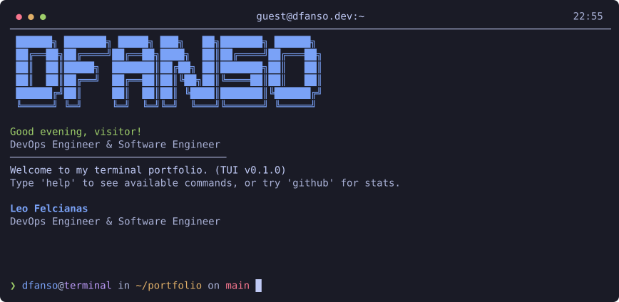
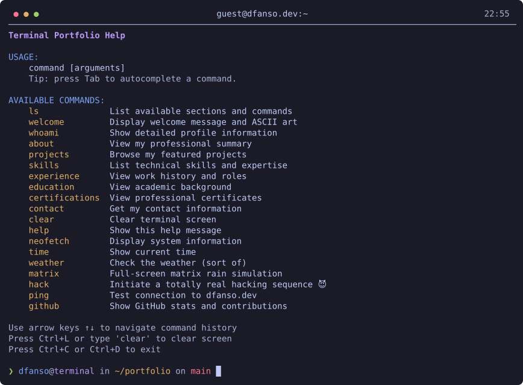
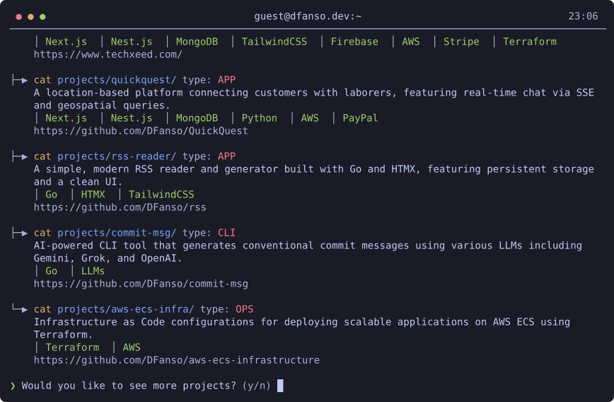
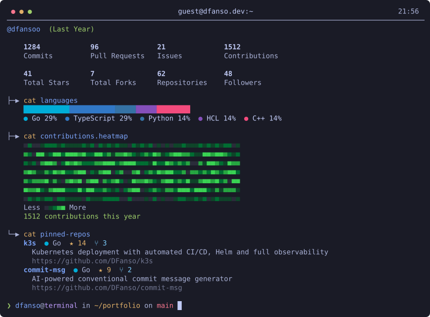
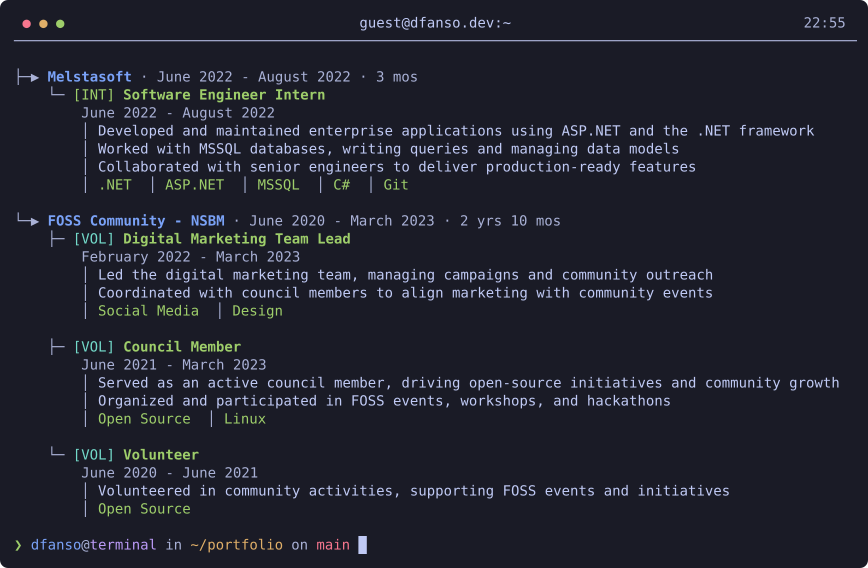
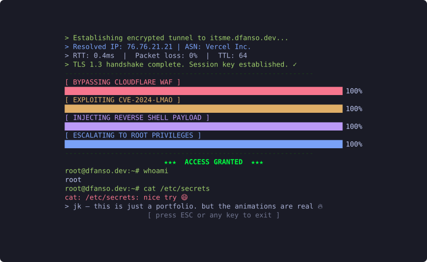
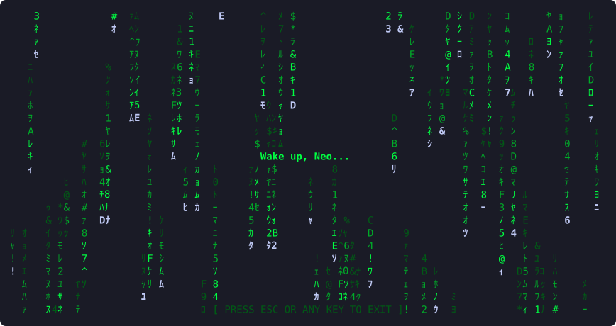

# itsme.dfanso.dev — TUI edition

A native terminal version of [itsme.dfanso.dev](https://itsme.dfanso.dev), Leo Felcianas' terminal-style
portfolio, written in C++17 with [FTXUI](https://github.com/ArthurSonzogni/FTXUI).

Same commands, same Tokyo Night colours, same easter eggs — in your own terminal.

## Screenshots

<p align="center"></p>

| `help` | `projects` |
|---|---|
|  |  |

| `github` (with `GITHUB_TOKEN`) | `experience` |
|---|---|
|  |  |

| `hack` | `matrix` |
|---|---|
|  |  |

Screenshots are rendered from the app itself by `tools/screenshots.cpp`
(`cmake --preset default -DITSME_BUILD_TOOLS=ON`, then `build/default/itsme_screenshots docs/screenshots`).

## Run

Download a binary from the Releases page, or build from source (below), then:

```
itsme                        # boot animation, then the shell
itsme --no-boot              # skip boot + typewriter
itsme --no-color             # 16-colour palette (also honours NO_COLOR)
GITHUB_TOKEN=ghp_... itsme   # unlocks commits/PRs/issues + contribution heatmap in `github`
```

Type `help` to list commands. Tab completes, ↑/↓ browse history, Ctrl+L clears, Ctrl+C / Ctrl+D exit.
Use a Unicode-capable terminal (Windows Terminal, not legacy conhost).

## Build

Requires CMake ≥ 3.20, a C++17 compiler and Ninja. Dependencies (FTXUI, nlohmann/json, Catch2, and libcurl
when it is not installed) are fetched automatically.

```
cmake --preset default
cmake --build --preset default
ctest --preset default
./build/default/itsme
```

Presets: `default` (Ninja, RelWithDebInfo), `release`, `ci` (warnings as errors), `msvc` (Visual Studio 2022).

## SSH mode

The binary reads stdin and writes ANSI to stdout, so it works unchanged as an SSH forced command:

```
# /etc/ssh/sshd_config.d/itsme.conf
Match User guest
    ForceCommand /usr/local/bin/itsme --no-boot
    PermitTTY yes
    PasswordAuthentication yes
    PermitEmptyPasswords yes
    AllowTcpForwarding no
    X11Forwarding no
```

In an SSH session the `resume` command prints the PDF URL instead of launching a browser.

## Layout

- `src/core` — command registry, dispatcher, state (pure, tested)
- `src/data` — portfolio content
- `src/outputs` — FTXUI renderers per command
- `src/github` — GitHub GraphQL/REST client and parsers
- `src/effects` — boot, typewriter, matrix, hack
- `src/app` — the interactive shell

## License

MIT — see `LICENSE`.
